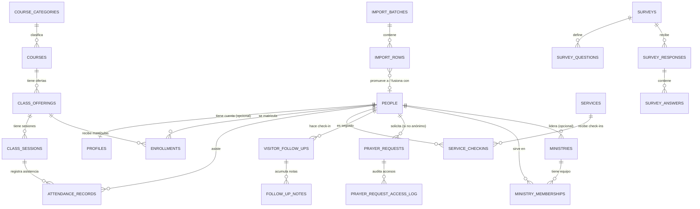

# Modelo de datos

Fuente de verdad: [`supabase/migrations/`](../supabase/migrations/) (SQL
versionado). Este documento es un resumen legible; ante cualquier
discrepancia, las migraciones mandan.

## 1. Diagrama (resumen de relaciones principales)

## 2. Tablas centrales

### `people`

Registro único por persona. **No** usa nombre como identificador — `id`
(uuid) es la clave. `membership_status`: `visitante | asistente_habitual
| miembro | inactivo`. Si es menor de edad se calcula al vuelo con la
función `is_minor(birth_date)` — no se guarda como columna, porque
"menor de edad" es una función del tiempo, no un hecho fijo de la fila
(y Postgres no permite `current_date` en columnas generadas).

### `profiles`

1:1 entre `auth.users` y `people` (`person_id` es `unique`). Se crea
automáticamente vía trigger `on_auth_user_created` al registrarse un
usuario. Si la persona ya existía en `people` (por ejemplo, fue invitada),
el trigger enlaza el `profile` a ese `person_id` en lugar de crear uno
nuevo (pasado en `raw_user_meta_data.person_id`).

### `user_roles`

`(user_id, role)` — un usuario puede tener múltiples filas (múltiples
roles). `role` es el enum `app_role` con los 7 roles mínimos.

## 3. Cursos y clases

- `course_categories`: catálogo **configurable** (tabla, no enum) de
  categorías. Sembrado inicial: hombres, mujeres, adoración, nuevos
  convertidos, liderazgo, otros.
- `courses`: catálogo de cursos dentro de una categoría.
- `class_offerings`: una instancia/cohorte concreta de un curso (fechas,
  horario, maestro, cupo). Es la unidad a la que se matricula gente.
- `class_sessions`: fechas de encuentro de una `class_offering`, base
  para tomar asistencia.

## 3.b Ministerios

- `ministries`: las áreas de servicio de la iglesia (alabanza, ujieres,
  niños, intercesión, medios...). Campos: `name` (único sin distinguir
  mayúsculas), `description`, `leader_person_id` → `people`,
  `meeting_schedule_text`, `location`, `is_active`.
- `ministry_memberships`: quién sirve en qué ministerio, con
  `role_in_ministry` (`lider | colider | miembro`), `joined_at` y
  `left_at`.
  - **Salir no borra la fila**: se marca `left_at`, conservando el
    histórico de servicio de la persona.
  - Índice único **parcial** `(ministry_id, person_id) where left_at is
null`: impide duplicar una membresía activa, pero permite que una
    persona vuelva a entrar después de haber salido.
- Una persona puede servir en varios ministerios simultáneamente.

## 4. Matrícula, asistencia y progreso

- `enrollments`: relación persona↔class_offering, con `status` (`inscrito
| en_progreso | completado | retirado`).
- `attendance_records`: asistencia por `(class_session, person)`, con
  `status` (`presente | ausente | excusado | tarde`).
- `enrollment_progress` (vista): calcula `attendance_percent` por
  matrícula a partir de las sesiones y la asistencia registrada. Usa
  `security_invoker = on` para heredar RLS de las tablas base.

## 5. Servicios y check-in

- `services`: cultos/eventos con fecha, tipo y bandera
  `is_checkin_open`.
- `service_checkins`: un check-in por `(service, person)`, con `method`
  (`qr | manual`). El check-in por QR se resuelve en un Route Handler que
  valida un token firmado de corta vida (ver `docs/security.md`), nunca
  confiando en el `person_id` enviado en crudo por el cliente.

## 6. Visitantes y seguimiento

- `visitor_follow_ups`: una "tarjeta" de seguimiento por persona con
  `status` (`pendiente | en_progreso | completado | no_contactable`) y
  `assigned_to` (usuario responsable).
- `follow_up_notes`: bitácora de intentos/contactos sobre un seguimiento.

## 7. Peticiones de oración

- `prayer_requests`: `content` es el texto confidencial. `is_anonymous`
  permite ocultar el `requester_person_id`. Acceso restringido por RLS a
  intercesor/pastor/administrador, el asignado, o el autor (si no es
  anónimo).
- `prayer_request_access_log`: auditoría de lecturas de detalle,
  alimentada por la función `log_prayer_request_access()` desde la capa
  de datos del servidor (no hay trigger de `SELECT` en Postgres).

## 8. Notificaciones y encuestas

- `notification_templates`, `notification_log` (nunca guarda el
  contenido de una petición de oración).
- `surveys`, `survey_questions`, `survey_responses`, `survey_answers`.

## 9. Importación

- `import_batches`: un lote subido (archivo o captura manual).
- `import_rows`: una fila cruda (`raw_data`) + normalizada
  (`normalized_data`) + estado de coincidencia (`match_status`) +
  decisión humana (`decision`). `promote_import_row()` es la única forma
  soportada de pasar una fila a `people` (crea nuevo o fusiona con
  `matched_person_id`), y dispara desde código de aplicación, nunca
  automáticamente. Ver `docs/import-process.md`.

## 10. Auditoría

- `audit_log`: bitácora genérica de acciones administrativas sensibles
  (cambios de rol, fusiones, eliminaciones), alimentada por
  `log_audit_event()`.

## 11. Funciones auxiliares reutilizadas en políticas RLS

| Función                                    | Propósito                                                    |
| ------------------------------------------ | ------------------------------------------------------------ |
| `has_role(role)` / `has_any_role(roles[])` | ¿el usuario actual tiene ese rol?                            |
| `is_staff()`                               | ¿tiene algún rol distinto de `miembro`?                      |
| `is_admin()`                               | ¿es `pastor` o `administrador`?                              |
| `current_person_id()`                      | `person_id` vinculado al usuario autenticado actual          |
| `is_ministry_leader(ministry_id)`          | ¿el usuario lidera ESE ministerio? (autorización por ámbito) |
